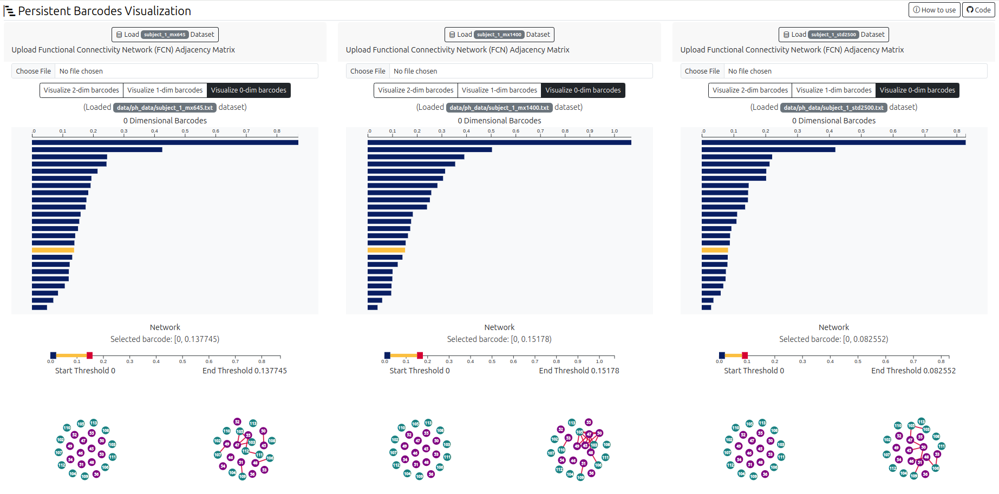

## Persistent Barcodes Visualization Application

A visualization tool that allows you to explore and analyze persistent barcodes derived from functional connectivity networks. This tool provides an intuitive way to understand the topological features of your data and gain valuable insights into the underlying structure.
Three side-by-side views displaying the persistent barcodes for the three different sampling periods: mx 645, mx 1400, and std 2500. This allows you to easily compare and contrast the topological features across these cohorts.

- Application URL: [TDA webapp](https://harp-lab.github.io/TDA/)
- Video demo: 

https://github.com/harp-lab/TDA/assets/5465070/11ce4a75-09e4-489a-9070-7c473c007932

### References

- [Ripser online tool](https://live.ripser.org/)
- [Ripser Github repository](https://github.com/Ripser/ripser)
- [ROI names](https://github.com/ThomasYeoLab/CBIG/blob/master/stable_projects/brain_parcellation/Yeo2011_fcMRI_clustering/1000subjects_reference/Yeo_JNeurophysiol11_SplitLabels/MNI152/Centroid_coordinates/Yeo2011_17Networks_N1000.split_components.FSL_MNI152_2mm.Centroid_RAS.csv)
