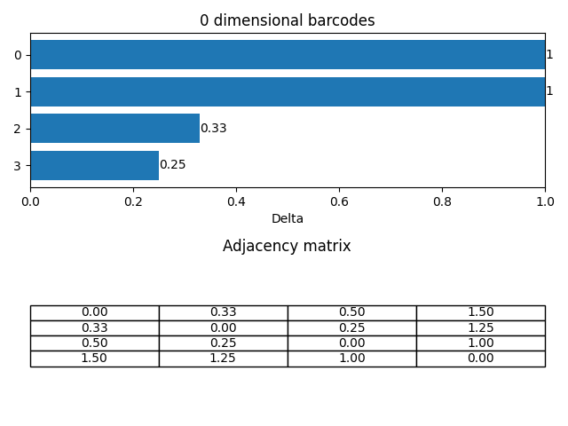
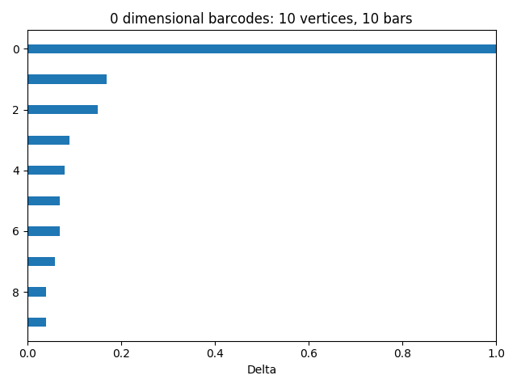
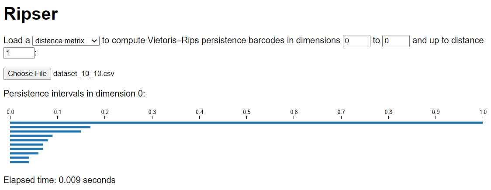
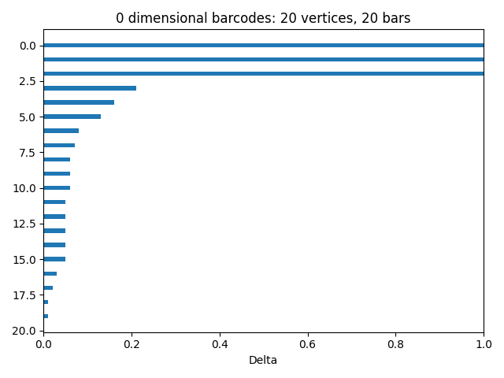
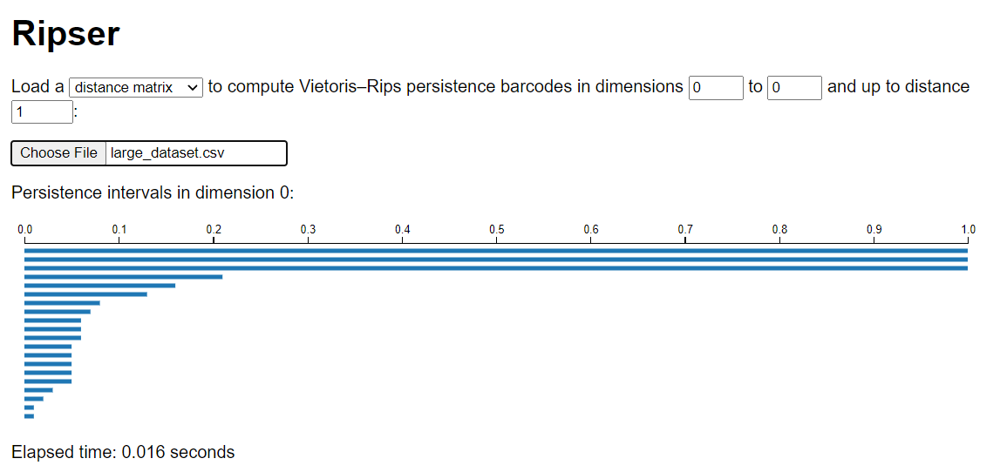
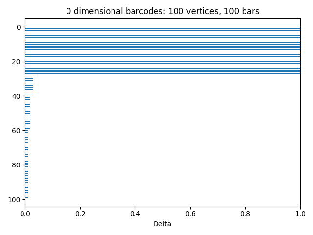
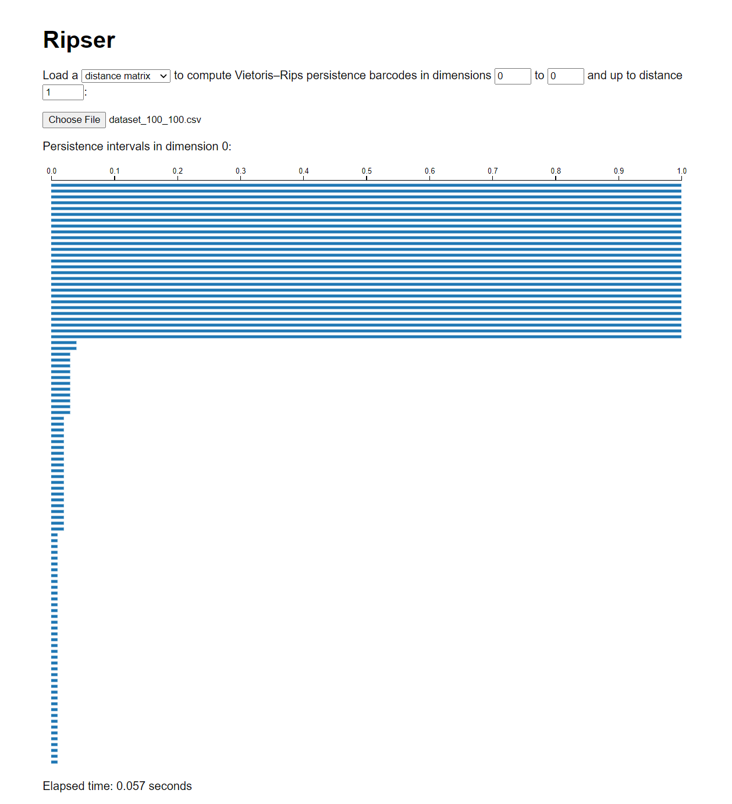

# TDA

TDA and Persistent homology

## Barcode generator



## Features

- Currently, the generator is able to generate 0-dimensional barcodes chart for
  a given adjacency matrix of a point cloud.
- Generates and stores `n * n` adjacency matrix in a CSV file.
- Load adjacency matrix from CSV file to generate barcodes. Several dummy
  datasets are included in the repository.

## Local Setup

### Requirements

- Python 3
- GCC
- [Boost](https://www.boost.org/doc/libs/1_77_0/more/getting_started/unix-variants.html)
  for `dionysus` package.

### Install dependencies

- Clone the repository.
- Open a terminal / powershell in the cloned repository.
- Create a virtual environment and activate it. If you are using Linux / Mac:

```commandline
python3 -m venv venv
source venv/bin/activate
```

Create and activate `venv` in Windows (Tested in Windows 10):

```commandline
python -m venv venv
Set-ExecutionPolicy -ExecutionPolicy RemoteSigned -Scope CurrentUser
.\venv\Scripts\Activate.ps1
```

After activated `venv`, the terminal / powershell will have `(venv)` added to
the prompt.

- Check `pip` version:

```commandline
pip --version
```

It should point to the `pip` in the activated `venv`.

- Install required packages:

```commandline
pip install -r requirements.txt
```

### Run the project

- Activate the `venv` if not activated:
  Linux / Mac:

```commandline
source venv/bin/activate
```

Windows:

```
.\venv\Scripts\activate.ps1
```

- The project allows command line arguments to generate 0-dimensional barcodes.
- Check the options:

```commandline
python main.py
```

It will list the available options to this project:

```commandline
usage: main.py [-h] [--list] [--all] [--data DATA] [--matrix]

optional arguments:
  -h, --help            show this help message and exit
  --list, -l            List available tests
  --all, -a             Produce all demo
  --data DATA, -d DATA  Input a specific dataset (case sensitive, must ends with .csv)
  --matrix, -m          Attach adjacency matrix with barcodes
```

- To run all demo:

```commandline
python main.py --all
```

- To generate barcode for a specific dataset:

```commandline
python main.py --data {DATASET_NAME}.csv
```

Example:

```commandline
python main.py --data time_varying_4_4.csv
```

- To generate barcode from lower distance matrix add `--lower` to the end.
Example:
```commandline
python main.py --data random16.lower_distance_matrix.csv --lower
```

### Compare with Ripser generator

Our generator provides 0-dimensional barcodes similar to Ripser generator. The
following table shows the isomorphic barcodes for identical datasets.

| Matrix size | Barcode generator | Ripser generator|
| --- | --- | --- |
| 4x4 |  |  |
| 10x10 |  |  |
| 20x20 |  |  |
| 100x100 |  |  |

### Time varying paper
- Create barcodes for given graphs:
```commandline
python main.py --data g0.csv --lower
```

## Reports

Details report of the project can be found in the [reports directory](reports/)
.

## Changelog

Changelog of the project is listed in [Changelog.md](Changelog.md) file. The
following commmand will generate new changelog based on commit messages:

```commandline
git log --pretty="- %s" > Changelog.md
```

## External library
- RDDR:
```commandline
library(TDA)

A = matrix(c(0, 0, 0.5, 0, 0, 1.2, 0, 0, 1.2, 0, 0, 2.5, 0, 0, 3.3, 0, 0, 3.3), nrow=6, ncol=3, byrow = TRUE)
B = matrix(c(0, 0, 0.5, 0, 0, 1.2, 0, 0, 2.0, 0, 0, 2.5, 0, 0, 5.0, 0, 0, 5.0), nrow=6, ncol=3, byrow = TRUE)
wassersteinDist <- wasserstein(A, B, p = 1, dimension = 0)
print(wassersteinDist)
# 4.2

library(TDA)

A = matrix(c(0, 0, 0.5, 0, 0, 1.2, 0, 0, 1.2, 0, 0, 2.5, 0, 0, 3.3, 0, 0, Inf), nrow=6, ncol=3, byrow = TRUE)
B = matrix(c(0, 0, 0.5, 0, 0, 1.2, 0, 0, 2.0, 0, 0, 2.5, 0, 0, 5.0, 0, 0, Inf), nrow=6, ncol=3, byrow = TRUE)
wassersteinDist <- wasserstein(A, B, p = 1, dimension = 0)
print(wassersteinDist)
# 2.5

```

### References

- [Ripser online tool](https://live.ripser.org/)
- [Ripser Github repository](https://github.com/Ripser/ripser)
- [Dionysus 2 Github repository](https://github.com/mrzv/dionysus)
- [Dionysus slides](https://www.mrzv.org/software/dionysus/_downloads/dionysus-slides.pdf)
- [Dionysus 2 documentation](https://mrzv.org/software/dionysus2/tutorial/basics.html)
- [Ripser python package](https://pypi.org/project/ripser/)
- [Ripser python package api reference](https://ripser.scikit-tda.org/en/latest/reference/stubs/ripser.ripser.html#ripser.ripser)
- [Gudhi Wasserstein Distance](https://gudhi.inria.fr/python/latest/wasserstein_distance_user.html)