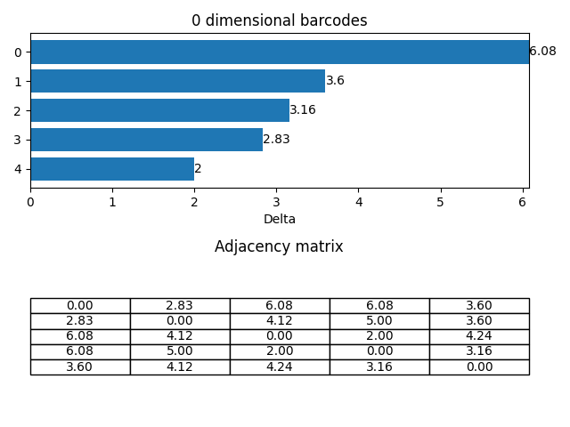

# TDA

TDA and Persistent homology


# Python App
## Features

- Generates 0-dimensional barcodes chart for a given adjacency matrix of a point
  cloud.
- Generates and stores `n * n` adjacency matrix in a CSV file.
- Load adjacency matrix from CSV file to generate barcodes. Several dummy datasets are included in the repository.

## Local Setup

### Requirements

- Python 3

### Install dependencies

- Clone the repository.
- Open a terminal / powershell in the cloned repository.
- Create a virtual environment and activate it. If you are using Linux / Mac:

```commandline
cd python_app
python3 -m venv venv
source venv/bin/activate
```

Create and activate `venv` in Windows (Tested in Windows 10):

```commandline
python -m venv venv
Set-ExecutionPolicy -ExecutionPolicy RemoteSigned -Scope CurrentUser
.\venv\Scripts\Activate.ps1
```

After activated `venv`, the terminal / powershell will have `(venv)` added to the prompt.

- Check `pip` version:

```commandline
pip --version
```

It should point to the `pip` in the activated `venv`.

- Install required packages:

```commandline
pip install -r requirements.txt
```

### Run the project

- Activate the `venv` if not activated:
  Linux / Mac:

```commandline
source venv/bin/activate
```

Windows:

```
.\venv\Scripts\activate.ps1
```

- The project allows command line arguments to generate 0-dimensional barcodes.
- Check the options:

```commandline
python main.py
```

It will list the available options to this project:

```commandline
usage: main.py [-h] [--list] [--all] [--data DATA] [--matrix]

optional arguments:
  -h, --help            show this help message and exit
  --list, -l            List available tests
  --all, -a             Produce all demo
  --data DATA, -d DATA  Input a specific dataset (case sensitive, must ends with .csv)
  --matrix, -m          Attach adjacency matrix with barcodes
```

- To run all demo:

```commandline
python main.py --all
```

- To generate barcode for a specific dataset:

```commandline
python main.py --data {DATASET_NAME}.csv
```

Example:

```commandline
python main.py --data ../data/time_varying_4_4.csv
```

- To generate barcode including adjacency matrix for a specific dataset:

```commandline
python main.py --data {DATASET_NAME}.csv --matrix
```

Example:

```commandline
python main.py --data ../data/time_varying_4_4.csv --matrix
```


### Compare with Ripser generator

Our generator provides 0-dimensional barcodes similar to Ripser generator. The following table shows the isomorphic
barcodes for identical datasets.

| Matrix size | Barcode generator                          | Ripser generator                                  |
|-------------|--------------------------------------------|---------------------------------------------------|
| 4x4         |          |          |
| 10x10       |      |      |
| 20x20       |      |      |
| 100x100     |  |  |
| demo data   |     |     |

## Reports

Details report of the project can be found in the [reports directory](reports/).

## Changelog

Changelog of the project is listed in [Changelog.md](python_app/Changelog.md) file. The following commmand will generate new
changelog based on commit messages:

```commandline
git log --pretty="- %s" > Changelog.md
```

### References

- [Ripser online tool](https://live.ripser.org/)
- [Ripser Github repository](https://github.com/Ripser/ripser)