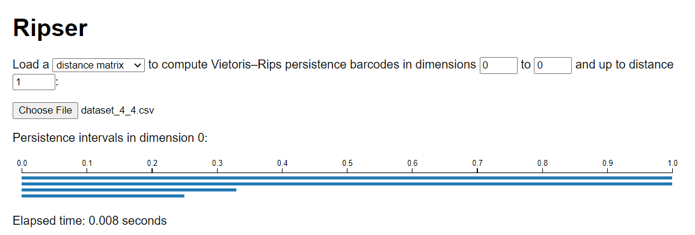

# TDA
TDA and Persistent homology

## Barcode generator


## Features

- Currently, the generator is able to generate 0-dimensional barcodes chart for a given adjacency matrix of a point cloud.
- Generates and stores `n * n` adjacency matrix in a CSV file.
- Load adjacency matrix from CSV file to generate barcodes. Several dummy datasets are included in the repository.

## Local Setup

### Requirements

- Python 3

### Install dependencies

- Clone the repository.
- Open a terminal / powershell in the cloned repository.
- Create a virtual environment and activate it. If you are using Linux / Mac:

```commandline
python3 -m venv venv
source venv/bin/activate
```

Create and activate `venv` in Windows (Tested in Windows 10):

```commandline
python -m venv venv
Set-ExecutionPolicy -ExecutionPolicy RemoteSigned -Scope CurrentUser
.\venv\Scripts\Activate.ps1
```

After activated `venv`, the terminal / powershell will have `(venv)` added to the prompt.

- Check `pip` version:

```commandline
pip --version
```

It should point to the `pip` in the activated `venv`.

- Install required packages:

```commandline
pip install -r requirements.txt
```

### Run the project

- Activate the `venv` if not activated:
  Linux / Mac:

```commandline
source venv/bin/activate
```

Windows:

```
.\venv\Scripts\activate.ps1
```

- To run the project run the [main.py](./main.py):

```commandline
python3 main.py
```

or

```commandline
python main.py
```

### Compare with Ripser generator

Our generator provides 0-dimensional barcodes similar to Ripser generator. The following table shows the isomorphic barcodes for identical datasets.

| Matrix size | Barcode generator | Ripser generator|
| --- | --- | --- |
| 4x4 |  |  |
| 10x10 |  |  |
| 20x20 |  |  |
| 100x100 |  |  |

## Reports
Details report of the project can be found in the [reports directory](reports/).

### References

- [Ripser online tool](https://live.ripser.org/)
- [Ripser Github repository](https://github.com/Ripser/ripser)