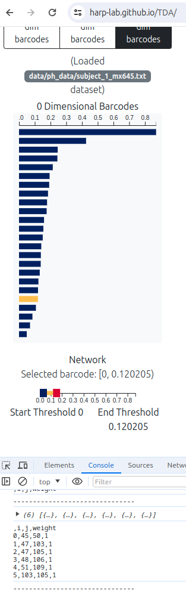

## Barcodes visualization on NetPlotBrain

- Create dataset or use existing PH dataset of 113x113 matrix: [https://github.com/harp-lab/brainPH/tree/main/datasets](https://github.com/harp-lab/brainPH/tree/main/datasets)
- First phase: Webapp: [https://harp-lab.github.io/TDA/](https://harp-lab.github.io/TDA/)
  - Upload the data in web app 
  - Generate 0-dim barcodes in the webapp
  - Click on the 3rd bar, 7th bar, 13th bar, 19th bar from top if there are 24 bars (3, first quartile, second quartile, third quartile)
  - Each click generates edges which can be viewed in browser console:
  
  - Copy this console output for each bar
- Second phase: Python app
  - Go to the Python code folder and create a folder for each subject
  - From the webapp copied data create txt files for each cohort and each quartile like:
    - 645_3.txt, 645_first.txt, 645_mid.txt, 645_last.txt
  - [yeo_nodes.csv](yeo_nodes.csv) file contains the 24 nodes information (12 left hemisphere+12 right hemisphere) of default mode network extracted from [default_mode.csv](default_mode.csv)  
  - Run the Python app with passing the subject folder absolute path: 
    ```shell
python ph.py -d /media/shovon/Codes/GithubCodes/brainview/paper_exp/single_view/real/subject4
python ph.py -d /media/shovon/Codes/GithubCodes/brainview/paper_exp/single_view/real/subject31
python ph.py -d /media/shovon/Codes/GithubCodes/brainview/paper_exp/single_view/real/subject55
python ph.py -d /media/shovon/Codes/GithubCodes/brainview/paper_exp/single_view/real/subject189 
    ```
  - This will generate result images in the same folder
- Image similarity score and survey data creation:
```shell
python image_score.py
```


### Statistical analysis
- Single superior view:
```shell
Type: random
Average PSNR: 41.140479166666665
Average SRE: 60.075624999999995
Average SSIM: 0.9632083333333333
Average FSIM: 0.7468541666666667
Type: real
Average PSNR: 43.61127083333334
Average SRE: 61.24664583333333
Average SSIM: 0.9714583333333334
Average FSIM: 0.8098541666666668
```
- Multi view:
```shell
Type: random
Average PSNR: 41.6833125
Average SRE: 64.25177083333334
Average SSIM: 0.9684166666666667
Average FSIM: 0.7936666666666667
Type: real
Average PSNR: 44.110625
Average SRE: 65.4118125
Average SSIM: 0.9749791666666666
Average FSIM: 0.8398333333333333
```
#### Metrics Explanation
- PSNR (Peak Signal-to-Noise Ratio):
A measure of the peak error between two images.

- SRE (Signal-to-Reconstruction Error):
Measures the fidelity of image reconstruction.

- SSIM (Structural Similarity Index):
A measure of similarity between two images, considering changes in structural information. Values range from 0 to 1, with 1 indicating perfect similarity.

- FSIM (Feature Similarity Index):
Measures the similarity between two images based on low-level features. Like SSIM, values range from 0 to 1.

- The real dataset generally exhibits better quality across all metrics compared to the random dataset. This suggests that the images in the real dataset are:
  - Less noisy and of higher quality (higher PSNR).
  - More accurate in terms of reconstruction (higher SRE).
  - More structurally similar to the reference images (higher SSIM).
  - Better in terms of feature similarity (higher FSIM).
  
#### User Study
- Google form link: [https://forms.gle/9WqYers649KYCsrR7](https://forms.gle/9WqYers649KYCsrR7)


### References
- [Netplotbrain Paper](https://direct.mit.edu/netn/article/7/2/461/115202/NetPlotBrain-A-Python-package-for-visualizing)
- [Image Similarity Measures Python package](https://pypi.org/project/image-similarity-measures/)
- [Image Similarity Measures blog post](https://up42.com/blog/image-similarity-measures)
- [ROI names](https://github.com/ThomasYeoLab/CBIG/blob/master/stable_projects/brain_parcellation/Yeo2011_fcMRI_clustering/1000subjects_reference/Yeo_JNeurophysiol11_SplitLabels/MNI152/Centroid_coordinates/Yeo2011_17Networks_N1000.split_components.FSL_MNI152_2mm.Centroid_RAS.csv)