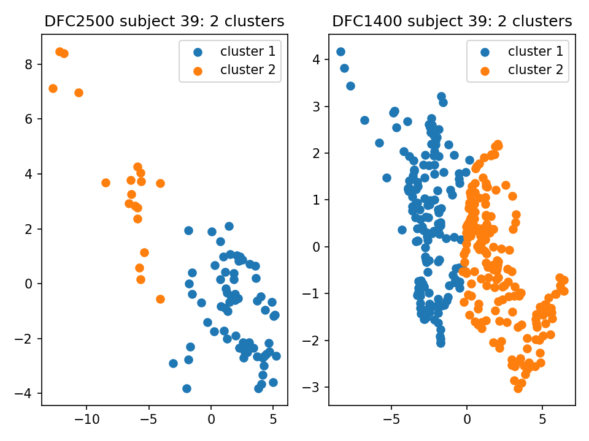

## Analysis on Cheaha
- Open the local directory in terminal.
- Copy all the files from local directory to Cheaha:
```
scp -r . ashovon@cheaha.rc.uab.edu:/home/ashovon/newaumri/matfiles/analysis/
```
- Open an SSH connection to Cheaha:
```
ssh ashovon@cheaha.rc.uab.edu
```
- Change directory to the desired directory:
```
cd newaumri/matfiles/analysis/
```
- Create a virtual environment to one directory up. 
So, we can pull the current directory to local machine again without the venv files.
```
python3 -m venv ../venv
```
- Activate the environment:
```
source ../venv/bin/activate
```
- Upgrade pip:
```
pip install --upgrade pip
```
- Install the requirements:
```
pip install -r cheaha_requirements.txt
```
- Run required Python file:
```
python distance_calculation.py
```

- Upload a file from local machine to Cheaha:
```
scp README.md ashovon@cheaha.rc.uab.edu:/home/ashovon/newaumri/matfiles/analysis/
scp run_bg.sh ashovon@cheaha.rc.uab.edu:/home/ashovon/newaumri/matfiles/analysis/
scp distance_calculation.py ashovon@cheaha.rc.uab.edu:/home/ashovon/newaumri/matfiles/analysis/
scp cluster_calculation.py ashovon@cheaha.rc.uab.edu:/home/ashovon/newaumri/matfiles/analysis/
```
- Upload all files from a local directory to Cheaha recursively:
```
scp -r . ashovon@cheaha.rc.uab.edu:/home/ashovon/newaumri/matfiles/analysis/dfc_1400_subjects_distance_matrix/
scp -r . ashovon@cheaha.rc.uab.edu:/home/ashovon/newaumri/matfiles/analysis/dfc_1400_subjects_mds/
scp -r . ashovon@cheaha.rc.uab.edu:/home/ashovon/newaumri/matfiles/analysis/dfc_2500_subjects_mds/
scp -r ashovon@cheaha.rc.uab.edu:/home/ashovon/newaumri/matfiles/analysis/clusters_kmeans/ . 
```

- Download all files from a Cheaha directory to local machine:
```
scp -r ashovon@cheaha.rc.uab.edu:/home/ashovon/newaumri/matfiles/analysis/ .
scp -r ashovon@cheaha.rc.uab.edu:/home/ashovon/newaumri/matfiles/analysis/clusters_kmeans .
scp -r ashovon@cheaha.rc.uab.edu:/home/ashovon/newaumri/matfiles/analysis .

```
- Run bash script in background:
```
nohup sh run_bg.sh > wasserstein.log &
nohup sh run_bg.sh > clusters.log &
nohup sh run_bg.sh > dfc_645.log &
```
- See the running scripts for the user:
```
ps aux | grep ashovon
```

### Clustering Results


Figure 1: Clustering result between DFC 2500 and DFC 1400


Figure 2: Clustering result of subject 1 for DFC 2500 and DFC 1400



Figure 3: Clustering result of subject 39 for DFC 2500 and DFC 1400


Figure 4: Clustering result of subject 63 for DFC 2500 and DFC 1400