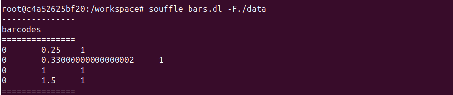
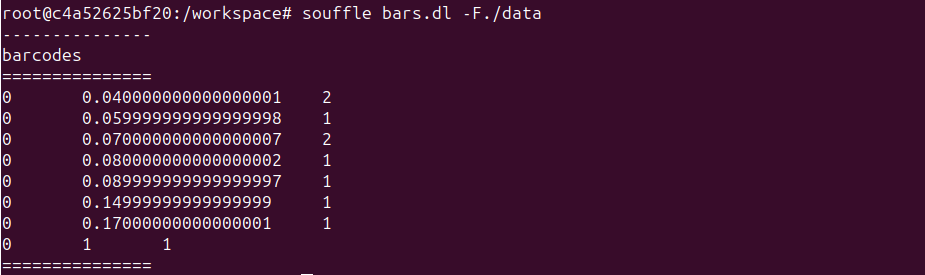
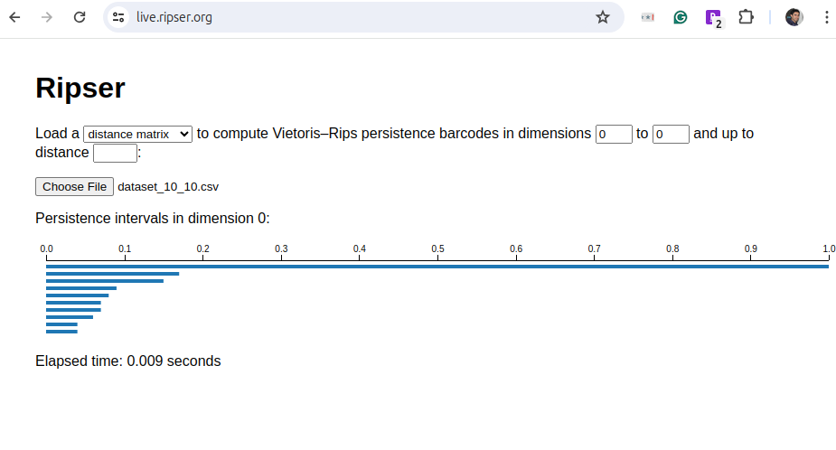
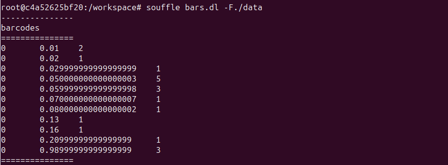
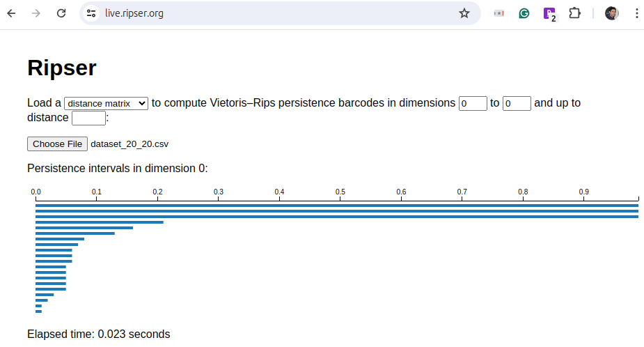
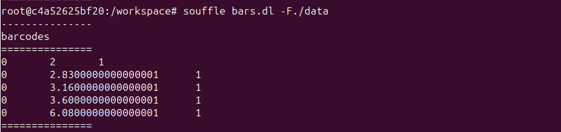
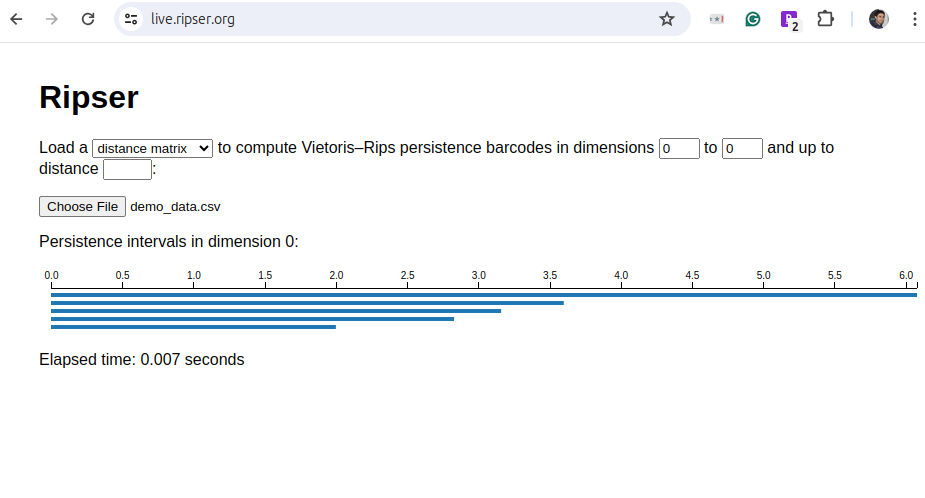

## 0-dim persistent barcodes using Souffle

- Build docker image and run container:
```shell
docker build -t 'souffle-image' .
docker run -v $(pwd):/workspace -it --name=souffle-container souffle-image
```
- Start exited container:
```shell
docker start -i souffle-container
```
- Create `edge.facts` from adjacency matrix file in the `data` folder:
```shell
python3 edge_maker.py -m data/time_varying_4_4.csv
# Wrote data/time_varying_4_4.facts and copied to data/edge.facts
```
This creates facts file and copied the data to `edge.facts`:
- Run Souffle program where there is an `edge.facts` file in `data` folder:
```shell
souffle bars.dl -F./data
root@c4a52625bf20:/workspace# souffle bars.dl -F./data
---------------
barcodes
===============
0	0.5	1
0	1.2	2
0	2.5	1
0	3.2999999999999998	1
0	6.2999999999999998	1
```

### Compare with Ripser generator

Our generator provides 0-dimensional barcodes similar to Ripser generator. The following table shows the isomorphic
barcodes for identical datasets.

| Matrix size | Barcode generator                          | Ripser generator                                  |
|-------------|--------------------------------------------|---------------------------------------------------|
| 4x4         |          |          |
| 10x10       |      |      |
| 20x20       |      |      |
| demo data   |     |     |

### References
- [Ripser web app](https://live.ripser.org/)