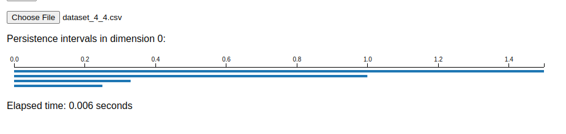

## 0-dimensional persistent barcodes
Persistent barcodes, a tool from persistent homology in topological data analysis, visually represent the lifespan of topological features across different scales in a dataset.

0-dimensional persistent barcodes represent the evolution of connected components in a data set as a function of a filtering parameter, such as distance or threshold. 
These barcodes represent intervals (bars) where each bar corresponds to a component that appears (birth) and persists until it merges with another component (death) as the filtering parameter increases. Each bar's length indicates the persistence of a component across thresholds.

The calculation involves constructing a filtration, computing the persistence of connected components at each threshold, and recording the birth and death times of each component. 0-dimensional persistent barcodes always start from 0 as they represent the birth of connected components, which initially appear at the smallest scale (0 distance or threshold) when each data point is considered its own component.


### 0-dim persistent barcodes using Souffle
#### Building and running the Docker container
Build the Docker image and run the container:
```shell
docker build -t 'souffle-image' .
docker run -v $(pwd):/workspace -it --name=souffle-container souffle-image
```
#### Data preparation
Create `edge.facts` from adjacency matrix file in the `data` folder:
```shell
python3 edge_maker.py -m <CSV path>
python3 edge_maker.py -m data/time_varying_4_4.csv
# Wrote data/time_varying_4_4.facts and copied to data/edge.facts
```
This creates adjancency list file and copies it to `edge.facts` which is used in Souffle code as input file.

#### Run Souffle program
Run the Souffle program (`bars.dl`) with the data file (`edge.facts`) located in the data folder:
```shell
souffle bars.dl -F./data
root@c4a52625bf20:/# cd workspace
root@c4a52625bf20:/workspace# souffle bars.dl -F./data
---------------
barcodes
===============
0	0.5	1
0	1.2	2
0	2.5	1
0	3.2999999999999998	1
0	6.2999999999999998	1
```
The program outputs the barcode information, showing the birth and death parameter values for each connected component.
- (Optional) Start exited container:
```shell
docker start -i souffle-container
```

### Compare with Ripser generator
Ripser is a state-of-the-art tool for efficiently computing Vietoris-Rips persistence barcodes[^tool].
Our generator provides 0-dimensional barcodes similar to Ripser. The following table shows the isomorphic
barcodes for identical datasets.

| Matrix size | Barcode generator                          | Ripser generator                                  |
|-------------|--------------------------------------------|---------------------------------------------------|
| 4x4         |          |          |
| 10x10       |      |      |
| 20x20       |      |      |
| demo data   |     |     |

**References**:

[^tool]: [Ripser web app](https://live.ripser.org/)